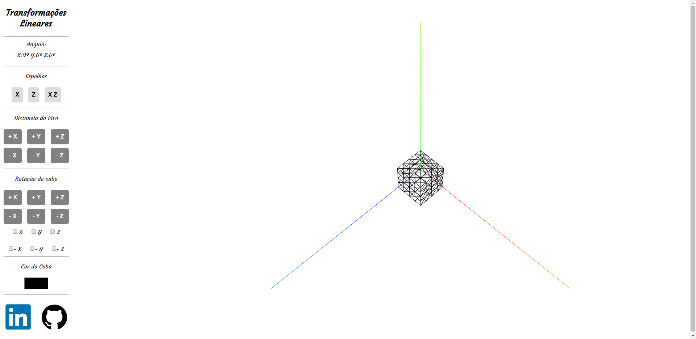
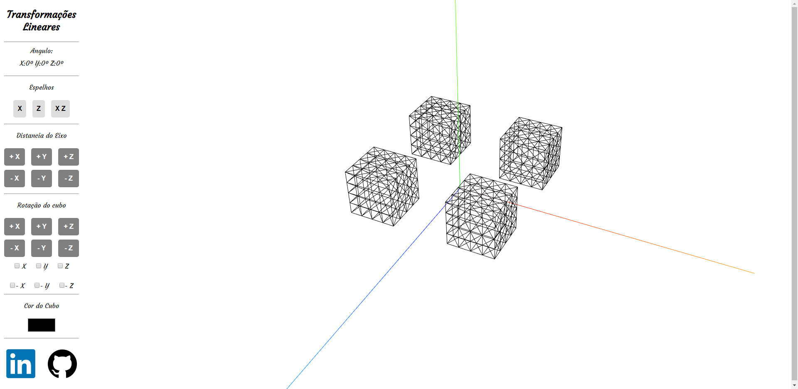

# Transformações Lineares em 3D
Se trata de uma ferramenta WEB para visualização e manipulação de um cubo em três dimensões.
O intuito é exemplificar a rotação do cubo nos eixos x, y e z, além de mostrar um espelho do cubo nos outros eixos.

O programa foi desenvolvido com o ThreeJS, se trata de uma biblioteca Javascript, na qual é gerado um canvas no HTML, nele é adicionado cenas, câmeras, luz, formas geométricas, entre muitas outras coisas. A documentação do ThreeJs conta com vários exemplos práticos, e muito conteúdo para consulta.

<a href="https://threejs.org/">ThreeJs</a>

